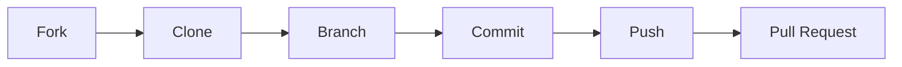

<div align="center">

<!-- Compact Header -->


# ZoneTech

**E-Commerce & Technical Support Platform**

<a href="https://git.io/typing-svg"></a>

<br/>

<!-- Status Badges -->


<!-- GitHub Stats -->
[](https://github.com/Andres-glitch-cell/zoneTech/stargazers)
[](https://github.com/Andres-glitch-cell/zoneTech/network/members)
[](https://github.com/Andres-glitch-cell/zoneTech/issues)

<!-- Tech Stack -->


</div>

---

<!-- Navigation Menu -->
<div align="center">

### Quick Navigation

<a href="#-sobre-el-proyecto">
  
</a>
<a href="#-demo-y-capturas">
  
</a>
<a href="#-características-principales">
  
</a>
<a href="#-arquitectura">
  
</a>
<a href="#-instalación">
  
</a>
<a href="#-uso">
  
</a>
<a href="#-roadmap">
  
</a>
<a href="#-contribuir">
  
</a>

</div>

---

<!-- About Section with Banner -->


<br/>

<div align="center">

##  Sobre el Proyecto

</div>

<br/>

<table>
<tr>
<td>


### Que es ZoneTech?

**ZoneTech** es una plataforma web integral de nueva generacion disenada especificamente para cubrir todas las necesidades del sector tecnologico actual. 

Combina tres pilares fundamentales:

- **E-Commerce Especializado** en productos de alta tecnologia
- **Sistema de Soporte Tecnico** profesional con seguimiento de tickets
- **Comunidad Activa** con foros y resenas de usuarios

> *Imagina un "MediaMarkt digital" donde puedes comprar tu nuevo portatil, solicitar la reparacion de tu smartphone y consultar opiniones de otros usuarios, todo en un mismo lugar.*

<br/>

</td>
</tr>
</table>

<br/>

<div align="center">

### Por que elegir ZoneTech?

</div>

<table>
<tr>
<td align="center" width="25%">


**Desarrollo Profesional**

Codigo limpio siguiendo estandares PSR-12 y mejores practicas de Laravel

</td>
<td align="center" width="25%">


**Escalabilidad**

Arquitectura preparada para crecer con tu negocio

</td>
<td align="center" width="25%">


**Seguridad**

Autenticacion robusta y proteccion contra vulnerabilidades

</td>
<td align="center" width="25%">


**Documentacion**

Codigo documentado y guias de uso completas

</td>
</tr>
</table>

---

<!-- Demo Section -->


<br/>

<div align="center">

##  Demo y Capturas

</div>

<br/>

<div align="center">

<!-- Placeholder para screenshots - reemplazar con imagenes reales -->
<table>
<tr>
<td align="center">
  
</td>
</tr>
</table>

<br/>

<!-- Demo GIF Placeholder -->


<br/>

*Se agregaran capturas de pantalla reales proximamente*

</div>

---

<!-- Features Section -->


<br/>

<div align="center">

##  Caracteristicas Principales

</div>

<br/>

<!-- Feature Cards with HTML -->
<div align="center">

<table>
<tr>
<td width="50%">

<h3 align="center">E-Commerce Avanzado</h3>

<div align="center">

</div>

<br/>

| Funcionalidad | Estado |
|:-------------:|:------:|
| Catalogo de productos | Done |
| Sistema de categorias | Done |
| Busqueda avanzada | Done |
| Filtros dinamicos | Done |
| Carrito de compras | In Progress |
| Wishlist | Planned |
| Comparador de productos | Planned |
| Pasarela de pagos | Planned |

</td>
<td width="50%">

<h3 align="center">Soporte Tecnico</h3>

<div align="center">

</div>

<br/>

| Funcionalidad | Estado |
|:-------------:|:------:|
| Sistema de tickets | Done |
| Estados y prioridades | Done |
| Asignacion de tecnicos | Done |
| Historial de reparaciones | Done |
| Notificaciones email | In Progress |
| Chat en tiempo real | Planned |
| Base de conocimientos | Planned |
| Informes y estadisticas | Planned |

</td>
</tr>
<tr>
<td width="50%">

<h3 align="center">Comunidad</h3>

<div align="center">

</div>

<br/>

| Funcionalidad | Estado |
|:-------------:|:------:|
| Perfiles de usuario | Done |
| Sistema de resenas | Done |
| Valoraciones con estrellas | Done |
| Foros tematicos | In Progress |
| Sistema de reputacion | Planned |
| Mensajeria privada | Planned |
| Notificaciones push | Planned |
| Gamificacion | Planned |

</td>
<td width="50%">

<h3 align="center">Seguridad y Admin</h3>

<div align="center">

</div>

<br/>

| Funcionalidad | Estado |
|:-------------:|:------:|
| Autenticacion multi-nivel | Done |
| Roles (Cliente/Tecnico/Admin) | Done |
| Proteccion CSRF | Done |
| Hashing de contrasenas | Done |
| Panel de administracion | In Progress |
| Logs de auditoria | Planned |
| 2FA | Planned |
| Backup automatico | Planned |

</td>
</tr>
</table>

</div>

<br/>

<!-- Responsive Design Banner -->
<div align="center">


<br/><br/>

<table>
<tr>
<td align="center">

<br/>
<b>Multi-dispositivo</b>
<br/>
<sub>Desktop, Tablet y Movil</sub>
</td>
<td align="center">

<br/>
<b>Cross-browser</b>
<br/>
<sub>Chrome, Firefox, Safari, Edge</sub>
</td>
<td align="center">

<br/>
<b>Optimizado</b>
<br/>
<sub>Rendimiento y SEO</sub>
</td>
<td align="center">

<br/>
<b>Accesible</b>
<br/>
<sub>WCAG 2.1 Guidelines</sub>
</td>
</tr>
</table>

</div>

---

<!-- Architecture Section -->


<br/>

<div align="center">

##  Arquitectura

</div>

<br/>

### Diagrama de Arquitectura del Sistema

```
                                    ┌──────────────────────────────────────────────────────────────┐
                                    │                        CLIENTE                                │
                                    │                                                              │
                                    │   ┌─────────────┐   ┌─────────────┐   ┌─────────────┐       │
                                    │   │   Desktop   │   │   Tablet    │   │   Mobile    │       │
                                    │   │   Browser   │   │   Browser   │   │   Browser   │       │
                                    │   └──────┬──────┘   └──────┬──────┘   └──────┬──────┘       │
                                    └──────────┼─────────────────┼─────────────────┼──────────────┘
                                               │                 │                 │
                                               └─────────────────┼─────────────────┘
                                                                 │
                                                                 ▼
┌────────────────────────────────────────────────────────────────────────────────────────────────────────────────┐
│                                              CAPA DE PRESENTACION                                              │
│  ┌──────────────────────────────────────────────────────────────────────────────────────────────────────────┐  │
│  │                                         BLADE TEMPLATES + TAILWIND CSS                                   │  │
│  │                                                                                                          │  │
│  │   ┌─────────────────┐    ┌─────────────────┐    ┌─────────────────┐    ┌─────────────────┐              │  │
│  │   │   Layouts       │    │   Components    │    │   Partials      │    │   Assets        │              │  │
│  │   │   ───────────   │    │   ───────────   │    │   ───────────   │    │   ───────────   │              │  │
│  │   │   • app.blade   │    │   • navbar      │    │   • header      │    │   • CSS/JS      │              │  │
│  │   │   • guest.blade │    │   • footer      │    │   • sidebar     │    │   • Images      │              │  │
│  │   │   • admin.blade │    │   • cards       │    │   • modals      │    │   • Fonts       │              │  │
│  │   └─────────────────┘    └─────────────────┘    └─────────────────┘    └─────────────────┘              │  │
│  └──────────────────────────────────────────────────────────────────────────────────────────────────────────┘  │
└────────────────────────────────────────────────────────────────────────────────────────────────────────────────┘
                                                                 │
                                                                 ▼
┌────────────────────────────────────────────────────────────────────────────────────────────────────────────────┐
│                                               CAPA DE APLICACION                                               │
│  ┌──────────────────────────────────────────────────────────────────────────────────────────────────────────┐  │
│  │                                              LARAVEL 11 FRAMEWORK                                        │  │
│  │                                                                                                          │  │
│  │   ┌───────────────────────────────┐         ┌───────────────────────────────┐                           │  │
│  │   │         ROUTING               │         │         MIDDLEWARE            │                           │  │
│  │   │   ┌─────────────────────┐     │         │   ┌─────────────────────┐     │                           │  │
│  │   │   │   web.php           │     │    ──►  │   │   Authentication    │     │                           │  │
│  │   │   │   api.php           │     │         │   │   Authorization     │     │                           │  │
│  │   │   │   channels.php      │     │         │   │   CSRF Protection   │     │                           │  │
│  │   │   └─────────────────────┘     │         │   └─────────────────────┘     │                           │  │
│  │   └───────────────────────────────┘         └───────────────────────────────┘                           │  │
│  │                      │                                      │                                            │  │
│  │                      ▼                                      ▼                                            │  │
│  │   ┌─────────────────────────────────────────────────────────────────────────────────────────────────┐   │  │
│  │   │                                        CONTROLLERS                                               │   │  │
│  │   │                                                                                                  │   │  │
│  │   │   ┌──────────────────┐  ┌──────────────────┐  ┌──────────────────┐  ┌──────────────────┐        │   │  │
│  │   │   │ ProductController│  │ TicketController │  │  UserController  │  │ ReviewController │        │   │  │
│  │   │   │                  │  │                  │  │                  │  │                  │        │   │  │
│  │   │   │  • index()       │  │  • index()       │  │  • profile()     │  │  • store()       │        │   │  │
│  │   │   │  • show()        │  │  • create()      │  │  • update()      │  │  • update()      │        │   │  │
│  │   │   │  • store()       │  │  • store()       │  │  • destroy()     │  │  • destroy()     │        │   │  │
│  │   │   │  • update()      │  │  • update()      │  │                  │  │                  │        │   │  │
│  │   │   │  • destroy()     │  │  • close()       │  │                  │  │                  │        │   │  │
│  │   │   └──────────────────┘  └──────────────────┘  └──────────────────┘  └──────────────────┘        │   │  │
│  │   └─────────────────────────────────────────────────────────────────────────────────────────────────┘   │  │
│  │                                                     │                                                    │  │
│  │                                                     ▼                                                    │  │
│  │   ┌─────────────────────────────────────────────────────────────────────────────────────────────────┐   │  │
│  │   │                                          SERVICES                                                │   │  │
│  │   │                                                                                                  │   │  │
│  │   │   ┌──────────────────┐  ┌──────────────────┐  ┌──────────────────┐  ┌──────────────────┐        │   │  │
│  │   │   │  CartService     │  │  PaymentService  │  │  TicketService   │  │  EmailService    │        │   │  │
│  │   │   └──────────────────┘  └──────────────────┘  └──────────────────┘  └──────────────────┘        │   │  │
│  │   └─────────────────────────────────────────────────────────────────────────────────────────────────┘   │  │
│  └──────────────────────────────────────────────────────────────────────────────────────────────────────────┘  │
└────────────────────────────────────────────────────────────────────────────────────────────────────────────────┘
                                                                 │
                                                                 ▼
┌────────────────────────────────────────────────────────────────────────────────────────────────────────────────┐
│                                                 CAPA DE DOMINIO                                                │
│  ┌──────────────────────────────────────────────────────────────────────────────────────────────────────────┐  │
│  │                                             ELOQUENT ORM                                                 │  │
│  │                                                                                                          │  │
│  │   ┌─────────────────────────────────────────────────────────────────────────────────────────────────┐   │  │
│  │   │                                           MODELS                                                 │   │  │
│  │   │                                                                                                  │   │  │
│  │   │   ┌────────────┐  ┌────────────┐  ┌────────────┐  ┌────────────┐  ┌────────────┐               │   │  │
│  │   │   │    User    │  │  Product   │  │   Ticket   │  │   Review   │  │  Category  │               │   │  │
│  │   │   │            │  │            │  │            │  │            │  │            │               │   │  │
│  │   │   │  id        │  │  id        │  │  id        │  │  id        │  │  id        │               │   │  │
│  │   │   │  name      │  │  name      │  │  user_id   │  │  user_id   │  │  name      │               │   │  │
│  │   │   │  email     │  │  price     │  │  tech_id   │  │  product_id│  │  slug      │               │   │  │
│  │   │   │  password  │  │  stock     │  │  status    │  │  rating    │  │  parent_id │               │   │  │
│  │   │   │  role      │  │  category  │  │  priority  │  │  comment   │  │            │               │   │  │
│  │   │   └────────────┘  └────────────┘  └────────────┘  └────────────┘  └────────────┘               │   │  │
│  │   │                                                                                                  │   │  │
│  │   │   ┌────────────┐  ┌────────────┐  ┌────────────┐  ┌────────────┐                               │   │  │
│  │   │   │   Order    │  │ OrderItem  │  │   Forum    │  │   Post     │                               │   │  │
│  │   │   │            │  │            │  │            │  │            │                               │   │  │
│  │   │   │  id        │  │  id        │  │  id        │  │  id        │                               │   │  │
│  │   │   │  user_id   │  │  order_id  │  │  name      │  │  forum_id  │                               │   │  │
│  │   │   │  total     │  │  product_id│  │  category  │  │  user_id   │                               │   │  │
│  │   │   │  status    │  │  quantity  │  │            │  │  content   │                               │   │  │
│  │   │   └────────────┘  └────────────┘  └────────────┘  └────────────┘                               │   │  │
│  │   └─────────────────────────────────────────────────────────────────────────────────────────────────┘   │  │
│  └──────────────────────────────────────────────────────────────────────────────────────────────────────────┘  │
└────────────────────────────────────────────────────────────────────────────────────────────────────────────────┘
                                                                 │
                                                                 ▼
┌────────────────────────────────────────────────────────────────────────────────────────────────────────────────┐
│                                                CAPA DE DATOS                                                   │
│  ┌──────────────────────────────────────────────────────────────────────────────────────────────────────────┐  │
│  │                                              MySQL 8.0+                                                  │  │
│  │                                                                                                          │  │
│  │   ┌────────────────────────────────────────────────────────────────────────────────────────────────┐    │  │
│  │   │                                         DATABASE: zonetech                                      │    │  │
│  │   │                                                                                                 │    │  │
│  │   │  ┌──────────┐  ┌──────────┐  ┌──────────┐  ┌──────────┐  ┌──────────┐  ┌──────────┐           │    │  │
│  │   │  │  users   │  │ products │  │ tickets  │  │ reviews  │  │ orders   │  │categories│           │    │  │
│  │   │  └──────────┘  └──────────┘  └──────────┘  └──────────┘  └──────────┘  └──────────┘           │    │  │
│  │   │                                                                                                 │    │  │
│  │   │  ┌──────────┐  ┌──────────┐  ┌──────────┐  ┌──────────┐  ┌──────────┐                         │    │  │
│  │   │  │  forums  │  │  posts   │  │ cart_items│  │migrations│  │ sessions │                         │    │  │
│  │   │  └──────────┘  └──────────┘  └──────────┘  └──────────┘  └──────────┘                         │    │  │
│  │   └────────────────────────────────────────────────────────────────────────────────────────────────┘    │  │
│  └──────────────────────────────────────────────────────────────────────────────────────────────────────────┘  │
└────────────────────────────────────────────────────────────────────────────────────────────────────────────────┘
```

<br/>

### Stack Tecnologico Detallado

<div align="center">

<table>
<tr>
<th align="center">Capa</th>
<th align="center">Tecnologia</th>
<th align="center">Version</th>
<th align="center">Proposito</th>
</tr>
<tr>
<td align="center">

<br/><b>Backend</b>
</td>
<td align="center">

<br/>Laravel
</td>
<td align="center"><code>11.x</code></td>
<td>Framework PHP principal, MVC, Eloquent ORM, Artisan CLI</td>
</tr>
<tr>
<td align="center">

<br/><b>Lenguaje</b>
</td>
<td align="center">

<br/>PHP
</td>
<td align="center"><code>8.2+</code></td>
<td>Typed properties, match expressions, fibers, enums</td>
</tr>
<tr>
<td align="center">

<br/><b>Base de Datos</b>
</td>
<td align="center">

<br/>MySQL
</td>
<td align="center"><code>8.0+</code></td>
<td>Almacenamiento relacional, indices, transacciones ACID</td>
</tr>
<tr>
<td align="center">

<br/><b>Estilos</b>
</td>
<td align="center">

<br/>Tailwind CSS
</td>
<td align="center"><code>3.x</code></td>
<td>Framework CSS utility-first, responsive design</td>
</tr>
<tr>
<td align="center">

<br/><b>Frontend</b>
</td>
<td align="center">

<br/>JavaScript ES6+
</td>
<td align="center"><code>ES2022</code></td>
<td>Interactividad, AJAX, manipulacion del DOM</td>
</tr>
<tr>
<td align="center">

<br/><b>Templates</b>
</td>
<td align="center">

<br/>Blade
</td>
<td align="center"><code>--</code></td>
<td>Motor de plantillas de Laravel, componentes, slots</td>
</tr>
<tr>
<td align="center">

<br/><b>DB Admin</b>
</td>
<td align="center">

<br/>phpMyAdmin
</td>
<td align="center"><code>5.x</code></td>
<td>Administracion visual de MySQL en desarrollo</td>
</tr>
<tr>
<td align="center">

<br/><b>Control Versiones</b>
</td>
<td align="center">

<br/>Git + GitHub
</td>
<td align="center"><code>--</code></td>
<td>Versionado, colaboracion, CI/CD</td>
</tr>
</table>

</div>

---

<!-- Project Structure Section -->


<br/>

<div align="center">

##  Estructura del Proyecto

</div>

<br/>

```
zoneTech/
│
├── app/                                 # Nucleo de la aplicacion
│   ├── Console/                         # Comandos Artisan personalizados
│   │   └── Commands/
│   │       └── CleanExpiredTickets.php
│   │
│   ├── Exceptions/                      # Manejadores de excepciones
│   │   └── Handler.php
│   │
│   ├── Http/                            # Capa HTTP
│   │   ├── Controllers/                 # Controladores
│   │   │   ├── Auth/
│   │   │   │   ├── LoginController.php
│   │   │   │   ├── RegisterController.php
│   │   │   │   └── ForgotPasswordController.php
│   │   │   │
│   │   │   ├── Admin/
│   │   │   │   ├── DashboardController.php
│   │   │   │   ├── ProductController.php
│   │   │   │   └── UserController.php
│   │   │   │
│   │   │   ├── ProductController.php
│   │   │   ├── TicketController.php
│   │   │   ├── ReviewController.php
│   │   │   ├── CartController.php
│   │   │   ├── OrderController.php
│   │   │   ├── ForumController.php
│   │   │   └── ProfileController.php
│   │   │
│   │   ├── Middleware/                  # Middleware personalizado
│   │   │   ├── AdminMiddleware.php
│   │   │   ├── TechnicianMiddleware.php
│   │   │   └── CheckRole.php
│   │   │
│   │   └── Requests/                    # Form Requests (validacion)
│   │       ├── StoreProductRequest.php
│   │       ├── StoreTicketRequest.php
│   │       └── UpdateProfileRequest.php
│   │
│   ├── Models/                          # Modelos Eloquent
│   │   ├── User.php
│   │   ├── Product.php
│   │   ├── Category.php
│   │   ├── Ticket.php
│   │   ├── Review.php
│   │   ├── Order.php
│   │   ├── OrderItem.php
│   │   ├── Forum.php
│   │   └── Post.php
│   │
│   ├── Policies/                        # Politicas de autorizacion
│   │   ├── TicketPolicy.php
│   │   ├── ReviewPolicy.php
│   │   └── PostPolicy.php
│   │
│   ├── Providers/                       # Service Providers
│   │   ├── AppServiceProvider.php
│   │   ├── AuthServiceProvider.php
│   │   └── EventServiceProvider.php
│   │
│   └── Services/                        # Servicios de negocio
│       ├── CartService.php
│       ├── PaymentService.php
│       └── NotificationService.php
│
├── bootstrap/                           # Archivos de arranque
│   └── app.php
│
├── config/                              # Configuracion
│   ├── app.php
│   ├── auth.php
│   ├── database.php
│   ├── mail.php
│   └── ...
│
├── database/                            # Base de datos
│   ├── factories/                       # Model Factories
│   │   ├── UserFactory.php
│   │   ├── ProductFactory.php
│   │   └── TicketFactory.php
│   │
│   ├── migrations/                      # Migraciones
│   │   ├── 2024_01_01_create_users_table.php
│   │   ├── 2024_01_02_create_categories_table.php
│   │   ├── 2024_01_03_create_products_table.php
│   │   ├── 2024_01_04_create_tickets_table.php
│   │   ├── 2024_01_05_create_reviews_table.php
│   │   ├── 2024_01_06_create_orders_table.php
│   │   ├── 2024_01_07_create_forums_table.php
│   │   └── ...
│   │
│   └── seeders/                         # Seeders
│       ├── DatabaseSeeder.php
│       ├── UserSeeder.php
│       ├── CategorySeeder.php
│       └── ProductSeeder.php
│
├── public/                              # Archivos publicos
│   ├── index.php                        # Entry point
│   ├── css/
│   ├── js/
│   ├── images/
│   └── .htaccess
│
├── resources/                           # Recursos
│   ├── css/                             # Estilos
│   │   └── app.css
│   │
│   ├── js/                              # JavaScript
│   │   └── app.js
│   │
│   └── views/                           # Vistas Blade
│       ├── layouts/
│       │   ├── app.blade.php
│       │   ├── guest.blade.php
│       │   └── admin.blade.php
│       │
│       ├── components/
│       │   ├── navbar.blade.php
│       │   ├── footer.blade.php
│       │   ├── product-card.blade.php
│       │   └── ticket-status.blade.php
│       │
│       ├── auth/
│       │   ├── login.blade.php
│       │   ├── register.blade.php
│       │   └── forgot-password.blade.php
│       │
│       ├── products/
│       │   ├── index.blade.php
│       │   ├── show.blade.php
│       │   └── category.blade.php
│       │
│       ├── tickets/
│       │   ├── index.blade.php
│       │   ├── create.blade.php
│       │   └── show.blade.php
│       │
│       ├── admin/
│       │   ├── dashboard.blade.php
│       │   ├── products/
│       │   └── users/
│       │
│       └── ...
│
├── routes/                              # Rutas
│   ├── web.php                          # Rutas web
│   ├── api.php                          # Rutas API
│   ├── console.php                      # Comandos de consola
│   └── channels.php                     # Canales de broadcasting
│
├── storage/                             # Almacenamiento
│   ├── app/
│   ├── framework/
│   └── logs/
│
├── tests/                               # Tests
│   ├── Feature/
│   │   ├── ProductTest.php
│   │   ├── TicketTest.php
│   │   └── AuthenticationTest.php
│   │
│   └── Unit/
│       ├── CartServiceTest.php
│       └── UserTest.php
│
├── vendor/                              # Dependencias (git ignored)
│
├── .env.example                         # Variables de entorno ejemplo
├── .gitignore                           # Archivos ignorados por Git
├── artisan                              # CLI de Laravel
├── composer.json                        # Dependencias PHP
├── composer.lock                        # Lock de dependencias PHP
├── package.json                         # Dependencias NPM
├── package-lock.json                    # Lock de dependencias NPM
├── phpunit.xml                          # Configuracion PHPUnit
├── tailwind.config.js                   # Configuracion Tailwind
├── vite.config.js                       # Configuracion Vite
└── README.md                            # Este archivo
```

---

<!-- Prerequisites Section -->


<br/>

<div align="center">

##  Requisitos Previos

</div>

<br/>

<div align="center">

Antes de comenzar, asegurate de tener instalado lo siguiente en tu sistema:

<table>
<tr>
<th align="center">Requisito</th>
<th align="center">Version Minima</th>
<th align="center">Verificar Instalacion</th>
<th align="center">Enlace de Descarga</th>
</tr>
<tr>
<td align="center">

<br/><b>PHP</b>
</td>
<td align="center">

</td>
<td align="center">
<code>php -v</code>
</td>
<td align="center">
<a href="https://www.php.net/downloads">Descargar PHP</a>
</td>
</tr>
<tr>
<td align="center">

<br/><b>Composer</b>
</td>
<td align="center">

</td>
<td align="center">
<code>composer -V</code>
</td>
<td align="center">
<a href="https://getcomposer.org/download/">Descargar Composer</a>
</td>
</tr>
<tr>
<td align="center">

<br/><b>MySQL</b>
</td>
<td align="center">

</td>
<td align="center">
<code>mysql --version</code>
</td>
<td align="center">
<a href="https://dev.mysql.com/downloads/">Descargar MySQL</a>
</td>
</tr>
<tr>
<td align="center">

<br/><b>Node.js</b>
</td>
<td align="center">

</td>
<td align="center">
<code>node -v</code>
</td>
<td align="center">
<a href="https://nodejs.org/">Descargar Node.js</a>
</td>
</tr>
<tr>
<td align="center">

<br/><b>NPM</b>
</td>
<td align="center">

</td>
<td align="center">
<code>npm -v</code>
</td>
<td align="center">
<i>Incluido con Node.js</i>
</td>
</tr>
<tr>
<td align="center">

<br/><b>Git</b>
</td>
<td align="center">

</td>
<td align="center">
<code>git --version</code>
</td>
<td align="center">
<a href="https://git-scm.com/downloads">Descargar Git</a>
</td>
</tr>
</table>

</div>

<br/>

### Extensiones PHP Requeridas

```bash
# Verifica que tienes las siguientes extensiones:
php -m | grep -E "pdo|mysql|mbstring|xml|curl|zip|bcmath|gd"

# Extensiones necesarias:
# - pdo_mysql    (Conexion a MySQL)
# - mbstring     (Strings multibyte)
# - xml          (Procesamiento XML)
# - curl         (HTTP client)
# - zip          (Compresion)
# - bcmath       (Matematicas de precision)
# - gd / imagick (Procesamiento de imagenes)
```

---

<!-- Installation Section -->


<br/>

<div align="center">

##  Instalacion

</div>

<br/>

<div align="center">

</div>

<br/>

### Paso 1: Clonar el Repositorio

```bash
# Clonar usando HTTPS
git clone https://github.com/Andres-glitch-cell/zoneTech.git

# O usando SSH (recomendado si tienes configurada tu clave SSH)
git clone git@github.com:Andres-glitch-cell/zoneTech.git

# Entrar al directorio del proyecto
cd zoneTech
```

<br/>

### Paso 2: Instalar Dependencias PHP

```bash
# Instalar dependencias de produccion
composer install --optimize-autoloader --no-dev

# O para desarrollo (incluye dependencias de testing)
composer install
```

<details>
<summary><b>Solucion de problemas comunes</b></summary>

```bash
# Si hay errores de memoria
COMPOSER_MEMORY_LIMIT=-1 composer install

# Si hay errores de permisos
sudo chown -R $USER:$USER .

# Si hay extensiones faltantes
sudo apt install php8.2-{mysql,mbstring,xml,curl,zip,bcmath,gd}
```

</details>

<br/>

### Paso 3: Instalar Dependencias de Frontend

```bash
# Instalar dependencias NPM
npm install

# Compilar assets para desarrollo
npm run dev

# O compilar para produccion
npm run build
```

<br/>

### Paso 4: Configurar Variables de Entorno

```bash
# Copiar el archivo de ejemplo
cp .env.example .env

# Generar la clave de aplicacion
php artisan key:generate
```

<br/>

### Paso 5: Configurar la Base de Datos

Edita el archivo `.env` con tus credenciales de MySQL:

```env
#------------------------------------------
# CONFIGURACION DE BASE DE DATOS
#------------------------------------------

DB_CONNECTION=mysql
DB_HOST=127.0.0.1
DB_PORT=3306
DB_DATABASE=zonetech
DB_USERNAME=tu_usuario
DB_PASSWORD=tu_contraseña

#------------------------------------------
# CONFIGURACION DE APLICACION
#------------------------------------------

APP_NAME=ZoneTech
APP_ENV=local
APP_DEBUG=true
APP_URL=http://localhost:8000

#------------------------------------------
# CONFIGURACION DE CORREO (opcional)
#------------------------------------------

MAIL_MAILER=smtp
MAIL_HOST=smtp.mailtrap.io
MAIL_PORT=2525
MAIL_USERNAME=null
MAIL_PASSWORD=null
```

<br/>

### Paso 6: Crear la Base de Datos

```bash
# Opcion 1: Usando MySQL CLI
mysql -u root -p
CREATE DATABASE zonetech CHARACTER SET utf8mb4 COLLATE utf8mb4_unicode_ci;
exit;

# Opcion 2: Usando phpMyAdmin
# Simplemente crea una nueva base de datos llamada "zonetech"
```

<br/>

### Paso 7: Ejecutar Migraciones y Seeders

```bash
# Ejecutar migraciones (crear tablas)
php artisan migrate

# Ejecutar migraciones con datos de prueba
php artisan migrate --seed

# O ejecutar solo los seeders
php artisan db:seed
```

<br/>

### Paso 8: Configurar Permisos (Linux/Mac)

```bash
# Dar permisos de escritura a los directorios necesarios
chmod -R 775 storage bootstrap/cache
chown -R $USER:www-data storage bootstrap/cache
```

<br/>

### Paso 9: Iniciar el Servidor de Desarrollo

```bash
# Iniciar el servidor de Laravel
php artisan serve

# En otra terminal, iniciar Vite para hot reloading
npm run dev
```

<br/>

<div align="center">

### Listo!


Visita **`http://localhost:8000`** en tu navegador

</div>

---

<!-- Quick Start Section -->


<br/>

<div align="center">

##  Instalacion Rapida (One-liner)

</div>

<br/>

Para los que prefieren ir directo al grano:

```bash
# Todo en un solo comando (Linux/Mac)
git clone https://github.com/Andres-glitch-cell/zoneTech.git && \
cd zoneTech && \
composer install && \
npm install && \
cp .env.example .env && \
php artisan key:generate && \
echo "Configura tu .env con los datos de MySQL y ejecuta: php artisan migrate --seed"
```

<details>
<summary><b>Script de instalacion automatizada (install.sh)</b></summary>

```bash
#!/bin/bash

echo "======================================"
echo "   ZoneTech - Script de Instalacion  "
echo "======================================"

# Colores
GREEN='\033[0;32m'
YELLOW='\033[1;33m'
NC='\033[0m'

echo -e "${YELLOW}[1/6]${NC} Instalando dependencias PHP..."
composer install --optimize-autoloader

echo -e "${YELLOW}[2/6]${NC} Instalando dependencias NPM..."
npm install

echo -e "${YELLOW}[3/6]${NC} Configurando entorno..."
cp .env.example .env

echo -e "${YELLOW}[4/6]${NC} Generando clave de aplicacion..."
php artisan key:generate

echo -e "${YELLOW}[5/6]${NC} Compilando assets..."
npm run build

echo -e "${GREEN}======================================"
echo "   Instalacion completada!"
echo "======================================"
echo ""
echo "Pasos siguientes:"
echo "1. Configura tu base de datos en .env"
echo "2. Ejecuta: php artisan migrate --seed"
echo "3. Ejecuta: php artisan serve"
echo "======================================${NC}"
```

</details>

---

<!-- Usage Section -->


<br/>

<div align="center">

##  Uso

</div>

<br/>

### Comandos Artisan Utiles

```bash
# Servidor de desarrollo
php artisan serve                    # Inicia servidor en localhost:8000
php artisan serve --port=8080        # Puerto personalizado

# Base de datos
php artisan migrate                  # Ejecutar migraciones pendientes
php artisan migrate:rollback         # Revertir ultima migracion
php artisan migrate:fresh --seed     # Recrear BD con seeders
php artisan db:seed                  # Ejecutar todos los seeders

# Cache
php artisan cache:clear              # Limpiar cache de aplicacion
php artisan config:clear             # Limpiar cache de configuracion
php artisan route:clear              # Limpiar cache de rutas
php artisan view:clear               # Limpiar vistas compiladas
php artisan optimize:clear           # Limpiar toda la cache

# Desarrollo
php artisan make:controller Name     # Crear controlador
php artisan make:model Name -mfsc    # Modelo + migracion + factory + seeder + controlador
php artisan make:middleware Name     # Crear middleware
php artisan route:list               # Ver todas las rutas

# Testing
php artisan test                     # Ejecutar todos los tests
php artisan test --filter=TicketTest # Ejecutar test especifico
```

<br/>

### Usuarios de Prueba (Seeders)

Si ejecutaste los seeders, tienes acceso a estos usuarios de prueba:

| Rol | Email | Password |
|:---:|:-----:|:--------:|
| **Admin** | admin@zonetech.com | password |
| **Tecnico** | tecnico@zonetech.com | password |
| **Cliente** | cliente@zonetech.com | password |

<br/>

### Rutas Principales

| Ruta | Descripcion | Autenticacion |
|:-----|:------------|:-------------:|
| `/` | Pagina principal | No |
| `/productos` | Catalogo de productos | No |
| `/productos/{id}` | Detalle de producto | No |
| `/login` | Iniciar sesion | No |
| `/register` | Registro de usuario | No |
| `/dashboard` | Panel de usuario | Si |
| `/tickets` | Gestion de tickets | Si |
| `/tickets/create` | Crear nuevo ticket | Si |
| `/admin` | Panel de administracion | Admin |
| `/admin/productos` | Gestion de productos | Admin |
| `/admin/usuarios` | Gestion de usuarios | Admin |

---

<!-- Configuration Section -->


<br/>

<div align="center">

##  Configuracion Avanzada

</div>

<br/>

<details>
<summary><b>Configurar envio de correos</b></summary>

Para habilitar notificaciones por email, configura tu `.env`:

```env
# Usando Mailtrap (desarrollo)
MAIL_MAILER=smtp
MAIL_HOST=smtp.mailtrap.io
MAIL_PORT=2525
MAIL_USERNAME=tu_username_mailtrap
MAIL_PASSWORD=tu_password_mailtrap
MAIL_ENCRYPTION=tls
MAIL_FROM_ADDRESS="noreply@zonetech.com"
MAIL_FROM_NAME="${APP_NAME}"

# O usando Gmail (produccion)
MAIL_MAILER=smtp
MAIL_HOST=smtp.gmail.com
MAIL_PORT=587
MAIL_USERNAME=tu_email@gmail.com
MAIL_PASSWORD=tu_app_password
MAIL_ENCRYPTION=tls
```

</details>

<details>
<summary><b>Configurar almacenamiento de archivos</b></summary>

```bash
# Crear enlace simbolico para storage publico
php artisan storage:link

# Configurar disco en .env
FILESYSTEM_DISK=public
```

</details>

<details>
<summary><b>Configurar colas de trabajo (Jobs)</b></summary>

```env
# Usar base de datos como driver de colas
QUEUE_CONNECTION=database

# Crear tabla de jobs
php artisan queue:table
php artisan migrate

# Iniciar worker
php artisan queue:work
```

</details>

<details>
<summary><b>Personalizar el titulo de las paginas</b></summary>

En tus vistas Blade, utiliza la directiva `@section`:

```blade
@extends('layouts.app')

@section('title', 'Mi Titulo Personalizado')

@section('content')
    <!-- Contenido de la pagina -->
@endsection
```

Y en tu layout principal (`layouts/app.blade.php`):

```blade
<title>@yield('title', 'ZoneTech') - Tu Tienda Tecnologica</title>
```

</details>

<details>
<summary><b>Crear nuevas vistas</b></summary>

1. Crea el archivo en `resources/views/`:

```blade
{{-- resources/views/mi-pagina.blade.php --}}
@extends('layouts.app')

@section('title', 'Mi Nueva Pagina')

@section('content')
<div class="container mx-auto px-4 py-8">
    <h1 class="text-3xl font-bold">Mi Nueva Pagina</h1>
    <p>Contenido de la pagina...</p>
</div>
@endsection
```

2. Registra la ruta en `routes/web.php`:

```php
Route::get('/mi-pagina', function () {
    return view('mi-pagina');
})->name('mi-pagina');
```

</details>

---

<!-- API Section -->


<br/>

<div align="center">

##  API REST (Proximamente)

</div>

<br/>

<div align="center">

*La API REST esta actualmente en desarrollo*

</div>

```
Base URL: /api/v1

Endpoints planificados:

GET    /products           → Listar productos
GET    /products/{id}      → Obtener producto
POST   /products           → Crear producto (Admin)
PUT    /products/{id}      → Actualizar producto (Admin)
DELETE /products/{id}      → Eliminar producto (Admin)

GET    /tickets            → Listar tickets del usuario
POST   /tickets            → Crear ticket
GET    /tickets/{id}       → Obtener ticket
PUT    /tickets/{id}       → Actualizar ticket

GET    /reviews            → Listar resenas
POST   /reviews            → Crear resena
```

---

<!-- Testing Section -->


<br/>

<div align="center">

##  Testing

</div>

<br/>

```bash
# Ejecutar todos los tests
php artisan test

# Ejecutar tests con coverage
php artisan test --coverage

# Ejecutar tests especificos
php artisan test --filter=ProductTest
php artisan test --filter=test_user_can_create_ticket

# Ejecutar solo tests unitarios
php artisan test --testsuite=Unit

# Ejecutar solo tests de integracion
php artisan test --testsuite=Feature
```

### Estructura de Tests

```
tests/
├── Feature/
│   ├── Auth/
│   │   ├── LoginTest.php
│   │   └── RegistrationTest.php
│   ├── ProductTest.php
│   ├── TicketTest.php
│   └── ReviewTest.php
│
└── Unit/
    ├── Models/
    │   ├── UserTest.php
    │   └── ProductTest.php
    └── Services/
        └── CartServiceTest.php
```

---

<!-- Roadmap Section -->


<br/>

<div align="center">

##  Roadmap

</div>

<br/>

<div align="center">

```
                    ROADMAP DE DESARROLLO
    ════════════════════════════════════════════════════
    
    Q1 2024                    Q2 2024                    Q3 2024                    Q4 2024
    ─────────                  ─────────                  ─────────                  ─────────
    
    [DONE] Estructura          [IN PROGRESS]             [PLANNED]                  [PLANNED]
    base del proyecto          Carrito de compras        Chat en tiempo real        Aplicacion movil
    
    [DONE] Sistema de          [IN PROGRESS]             [PLANNED]                  [PLANNED]
    autenticacion              Panel de admin            API REST completa          PWA Support
    
    [DONE] CRUD de             [PLANNED]                 [PLANNED]                  [PLANNED]
    productos                  Pasarela de pagos         Notificaciones push        Marketplace
    
    [DONE] Sistema de          [PLANNED]                 [PLANNED]                  [PLANNED]
    tickets                    Sistema de colas          Multi-idioma (i18n)        Analytics
    
    [DONE] Resenas y           [PLANNED]                 [PLANNED]
    valoraciones               Tests automatizados       Documentacion API
    
    ════════════════════════════════════════════════════
```

</div>

<br/>

### Progreso Actual

<div align="center">

| Fase | Descripcion | Estado | Progreso |
|:----:|:------------|:------:|:--------:|
| **Fase 1** | Estructura Base y Autenticacion | Done |  |
| **Fase 2** | E-Commerce (Productos y Categorias) | Done |  |
| **Fase 3** | Sistema de Tickets y Soporte | Done |  |
| **Fase 4** | Comunidad (Resenas y Foros) | In Progress |  |
| **Fase 5** | Carrito y Pagos | In Progress |  |
| **Fase 6** | Panel de Administracion | Planned |  |
| **Fase 7** | API REST y Documentacion | Planned |  |
| **Fase 8** | Testing y Optimizacion | Planned |  |

</div>

---

<!-- Contributing Section -->


<br/>

<div align="center">

##  Contribuir

</div>

<br/>

<div align="center">

</div>

<br/>

Las contribuciones son lo que hace que la comunidad open source sea un lugar increible para aprender, inspirar y crear. **Cualquier contribucion que hagas sera muy apreciada.**

### Como Contribuir



<br/>

**Paso a paso:**

1. **Fork** el proyecto
   ```bash
   # Click en el boton "Fork" en GitHub
   ```

2. **Clone** tu fork
   ```bash
   git clone https://github.com/TU_USUARIO/zoneTech.git
   cd zoneTech
   ```

3. **Crea** una rama para tu feature
   ```bash
   git checkout -b feature/MiNuevaCaracteristica
   ```

4. **Haz** tus cambios y commitea
   ```bash
   git add .
   git commit -m "feat: agregar nueva caracteristica X"
   ```

5. **Push** a tu fork
   ```bash
   git push origin feature/MiNuevaCaracteristica
   ```

6. **Abre** un Pull Request

<br/>

### Convencion de Commits

Seguimos [Conventional Commits](https://www.conventionalcommits.org/):

| Tipo | Descripcion | Ejemplo |
|:----:|:------------|:--------|
| `feat` | Nueva caracteristica | `feat: anadir busqueda de productos` |
| `fix` | Correccion de bug | `fix: corregir validacion de email` |
| `docs` | Documentacion | `docs: actualizar README` |
| `style` | Formateo, semicolons, etc. | `style: aplicar PSR-12` |
| `refactor` | Refactorizacion | `refactor: simplificar CartService` |
| `test` | Anadir tests | `test: anadir tests para TicketController` |
| `chore` | Tareas de mantenimiento | `chore: actualizar dependencias` |
| `perf` | Mejoras de rendimiento | `perf: optimizar consultas N+1` |

<br/>

### Guia de Estilo

- Seguir **PSR-12** para codigo PHP
- Usar **ESLint** para JavaScript
- Documentar funciones complejas
- Escribir tests para nuevas funcionalidades
- Mantener los commits atomicos y descriptivos

---

<!-- Support Section -->


<br/>

<div align="center">

##  Soporte

</div>

<br/>

<div align="center">

Tienes preguntas? Estamos aqui para ayudarte!

<table>
<tr>
<td align="center" width="33%">

### Issues

<a href="https://github.com/Andres-glitch-cell/zoneTech/issues">

</a>

<br/>

Reportar bugs o solicitar features

[Abrir Issue](https://github.com/Andres-glitch-cell/zoneTech/issues/new)

</td>
<td align="center" width="33%">

### Discussions

<a href="https://github.com/Andres-glitch-cell/zoneTech/discussions">

</a>

<br/>

Preguntas y discusiones generales

[Iniciar Discusion](https://github.com/Andres-glitch-cell/zoneTech/discussions)

</td>
<td align="center" width="33%">

### Email

<a href="mailto:contacto@zonetech.com">

</a>

<br/>

Contacto directo

[Enviar Email](mailto:contacto@zonetech.com)

</td>
</tr>
</table>

</div>

---

<!-- License Section -->


<br/>

<div align="center">

##  Licencia

</div>

<br/>

<div align="center">

Distribuido bajo la Licencia MIT.

```
MIT License

Copyright (c) 2024 Andres

Permission is hereby granted, free of charge, to any person obtaining a copy
of this software and associated documentation files (the "Software"), to deal
in the Software without restriction, including without limitation the rights
to use, copy, modify, merge, publish, distribute, sublicense, and/or sell
copies of the Software, and to permit persons to whom the Software is
furnished to do so, subject to the following conditions:

The above copyright notice and this permission notice shall be included in all
copies or substantial portions of the Software.

THE SOFTWARE IS PROVIDED "AS IS", WITHOUT WARRANTY OF ANY KIND, EXPRESS OR
IMPLIED, INCLUDING BUT NOT LIMITED TO THE WARRANTIES OF MERCHANTABILITY,
FITNESS FOR A PARTICULAR PURPOSE AND NONINFRINGEMENT. IN NO EVENT SHALL THE
AUTHORS OR COPYRIGHT HOLDERS BE LIABLE FOR ANY CLAIM, DAMAGES OR OTHER
LIABILITY, WHETHER IN AN ACTION OF CONTRACT, TORT OR OTHERWISE, ARISING FROM,
OUT OF OR IN CONNECTION WITH THE SOFTWARE OR THE USE OR OTHER DEALINGS IN THE
SOFTWARE.
```

Ver [`LICENSE`](LICENSE) para mas informacion.

</div>

---

<!-- Contact Section -->


<br/>

<div align="center">

##  Contacto

</div>

<br/>

<div align="center">

<a href="https://github.com/Andres-glitch-cell">
  
</a>

<br/><br/>

**Andres** - Desarrollador Full Stack

<br/>

<a href="https://github.com/Andres-glitch-cell">
  
</a>

<br/><br/>

**Link del Proyecto:** [https://github.com/Andres-glitch-cell/zoneTech](https://github.com/Andres-glitch-cell/zoneTech)

</div>

---

<!-- Acknowledgments Section -->


<br/>

<div align="center">

##  Agradecimientos

</div>

<br/>

<div align="center">

Recursos y herramientas que hicieron posible este proyecto:

<table>
<tr>
<td align="center">
<a href="https://laravel.com">

</a>
<br/>
<b>Laravel</b>
</td>
<td align="center">
<a href="https://tailwindcss.com">

</a>
<br/>
<b>Tailwind CSS</b>
</td>
<td align="center">
<a href="https://www.php.net">

</a>
<br/>
<b>PHP</b>
</td>
<td align="center">
<a href="https://www.mysql.com">

</a>
<br/>
<b>MySQL</b>
</td>
<td align="center">
<a href="https://github.com">

</a>
<br/>
<b>GitHub</b>
</td>
</tr>
</table>

<br/>

**Recursos adicionales:**

- [Laravel Documentation](https://laravel.com/docs)
- [Tailwind CSS Documentation](https://tailwindcss.com/docs)
- [PHP Documentation](https://www.php.net/docs.php)
- [Shields.io](https://shields.io/) - Badges
- [Capsule Render](https://github.com/kyechan99/capsule-render) - Headers
- [Readme Typing SVG](https://github.com/DenverCoder1/readme-typing-svg) - Animaciones
- [GIPHY](https://giphy.com/) - GIFs
- [Icons8](https://icons8.com/) - Iconos

</div>

---

<!-- Stats Section -->
<div align="center">

## Estadisticas del Repositorio

<a href="https://github.com/Andres-glitch-cell/zoneTech">
  
</a>

</div>

---

<!-- Footer -->
<div align="center">

---

**Si te gusta el proyecto, dale una estrella!** [](https://github.com/Andres-glitch-cell/zoneTech)


<sub>Hecho con mass cafe por <a href="https://github.com/Andres-glitch-cell">Andres</a></sub>

</div>
